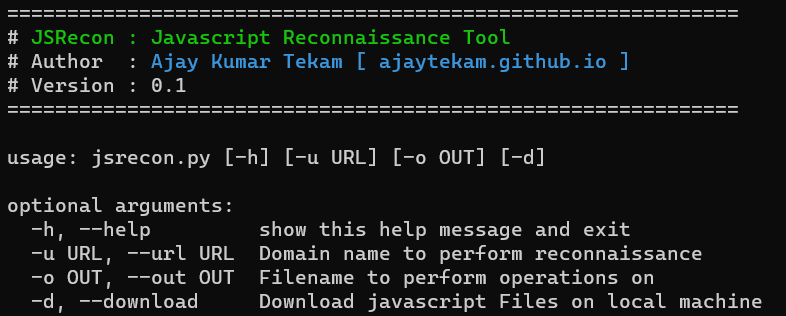

## JSRecon 

Perform Javascript files reconnaissance and perform some basic static code analysis.   

   

__Steps performed by app :__   

* Collect JS urls using subjs, gau, hakrawler  
* Find api endpoints, links using linkfinder  
* Find api keys, passwords and other secrets using secretfinder

__Tools used :__  

* [subjs](https://github.com/lc/subjs)   
* [gau](https://github.com/lc/gau)     
* [hakrawler](https://github.com/hakluke/hakrawler)   
* [linkfinder](https://github.com/GerbenJavado/LinkFinder)   
* [secretfinder](https://github.com/m4ll0k/SecretFinder)   
* [httpx](https://github.com/projectdiscovery/httpx)    

> Note : secretfinder and LinkFinder needs to be installed in `/root/tools/`. For secretfinder `/root/tools/LinkFinder/linkfinder.py` and for LinkFinder `/root/tools/SecretFinder/SecretFinder.py`.     

**Install Requirements :**    

```     
pip3 install -r requirements.txt
```     

**Usage :**     

```     
usage: jsrecon.py [-h] [-u URL] [-o OUT] [-d]

optional arguments:
  -h, --help         show this help message and exit
  -u URL, --url URL  Domain name to perform reconnaissance
  -o OUT, --out OUT  Filename to perform operations on
  -d, --download     Download javascript Files on local machine
```  


**Telegram Bot :** Needs to be added `/root/nofification.ini` file on server. 

```
[telegram]
apiToken = snldasdsljdffsdfvsd.....
chatId = 1234567
```
